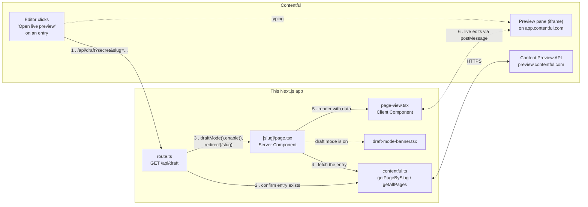

This is a [Next.js](https://nextjs.org) project bootstrapped with [`create-next-app`](https://nextjs.org/docs/app/api-reference/cli/create-next-app), extended with [Contentful](https://www.contentful.com) live preview and draft mode.

## Contentful Live Preview

This app demonstrates Contentful live preview end to end: an editor clicks "Open live preview" on an entry in Contentful, lands on this app with unpublished content visible, and sees their edits appear on the page as they type — without saving or refreshing.

### Key files

Everything needed to understand live preview lives in five files:

| File | What it does |
| --- | --- |
| [`src/lib/contentful.ts`](src/lib/contentful.ts) | Fetches entries from Contentful's Content Preview API. Every other file below goes through here to talk to Contentful. |
| [`src/app/api/draft/route.ts`](src/app/api/draft/route.ts) | The URL Contentful's preview button actually opens. Verifies the request, turns on Next.js Draft Mode, redirects to the page. |
| [`src/app/[slug]/page.tsx`](src/app/%5Bslug%5D/page.tsx) | The dynamic route (`/about`, `/contact`, ...). Fetches the entry on the server and hands it to `page-view.tsx`. |
| [`src/app/[slug]/page-view.tsx`](src/app/%5Bslug%5D/page-view.tsx) | Renders the entry in the browser and wires up Contentful's live-update and click-to-edit ("inspector mode") hooks, field by field. |
| [`src/app/draft-mode-banner.tsx`](src/app/draft-mode-banner.tsx) | The banner shown at the top of the page whenever Draft Mode is on, with a button to exit back to the published site. |

### How it fits together



Step by step:

1. **Open preview.** An editor clicks Preview in Contentful, which opens `/api/draft?secret=...&slug=...` — configured under the space's Content Preview settings.
2. **Verify.** `route.ts` checks the secret and confirms the slug matches a real entry, via `contentful.ts`.
3. **Enable Draft Mode.** `route.ts` calls Next.js's `draftMode().enable()` (which sets a cookie) and redirects the browser to `/${slug}`.
4. **Fetch.** `[slug]/page.tsx` fetches that same entry again — this time to actually render the page.
5. **Render.** The entry is passed to `page-view.tsx`, a Client Component, which renders it and (because draft mode is on) shows `draft-mode-banner.tsx` above it.
6. **Live edits.** As the editor types in Contentful, `page-view.tsx`'s `useContentfulLiveUpdates` hook receives the changes over `postMessage` and updates the page instantly. `useContentfulInspectorMode` is what makes hovering/clicking a field on the page jump to that field in the entry editor.

Outside of draft mode — i.e. a normal visitor — none of Contentful's live-preview SDK runs at all; see `live-preview-provider.tsx`, which only turns those two hooks on when `draftMode().isEnabled` is true.

## Getting Started

First, run the development server:

```bash
npm run dev
# or
yarn dev
# or
pnpm dev
# or
bun dev
```

Open [http://localhost:3000](http://localhost:3000) with your browser to see the result.

You can start editing the page by modifying `app/page.tsx`. The page auto-updates as you edit the file.

This project uses [`next/font`](https://nextjs.org/docs/app/building-your-application/optimizing/fonts) to automatically optimize and load [Geist](https://vercel.com/font), a new font family for Vercel.

## Learn More

To learn more about Next.js, take a look at the following resources:

- [Next.js Documentation](https://nextjs.org/docs) - learn about Next.js features and API.
- [Learn Next.js](https://nextjs.org/learn) - an interactive Next.js tutorial.

You can check out [the Next.js GitHub repository](https://github.com/vercel/next.js) - your feedback and contributions are welcome!

## Deploy on Vercel

The easiest way to deploy your Next.js app is to use the [Vercel Platform](https://vercel.com/new?utm_medium=default-template&filter=next.js&utm_source=create-next-app&utm_campaign=create-next-app-readme) from the creators of Next.js.

Check out our [Next.js deployment documentation](https://nextjs.org/docs/app/building-your-application/deploying) for more details.
